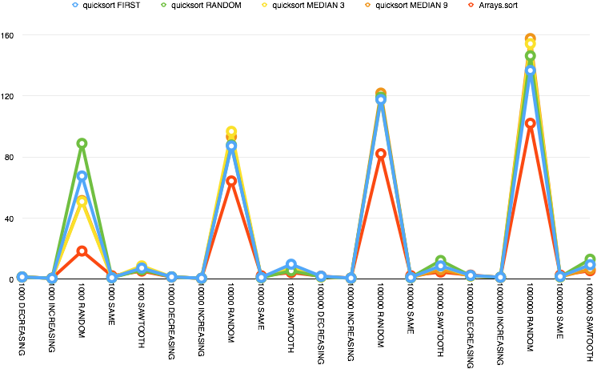
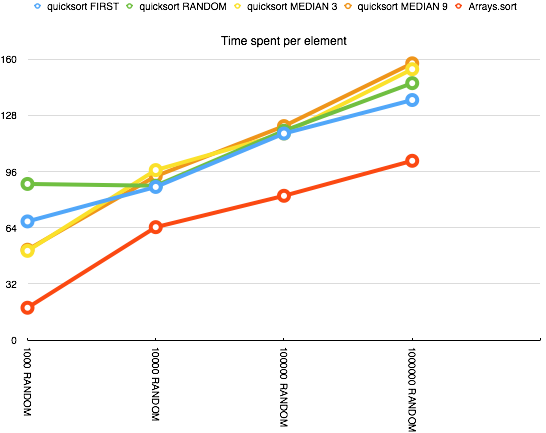

#Quicksort

##Inline partition vs method call for partitioning
[Result](https://microbenchmarks.appspot.com/runs/86723237-c8d9-465b-868d-a9ef899294f9#r:scenario.benchmarkSpec.parameters.distribution,scenario.benchmarkSpec.methodName&c:scenario.benchmarkSpec.parameters.length)

Noticing somewhat significant difference between function call and inline partioning. Opting for using inline partitioning.
##Finding breakpoint between quicksort and insertion sort
[Try 1](https://microbenchmarks.appspot.com/runs/5990487e-a406-41b2-8b43-f79b5438e400)

Fixing bug in insertion sort.

[Try 2](https://microbenchmarks.appspot.com/runs/d5918c16-5e1d-452c-9bb1-8fd6e3919ff8#r:scenario.benchmarkSpec.parameters.minRange&c:scenario.benchmarkSpec.parameters.algorithm)

_Potential best break points: 7, 8, 10_

Only using random pivot, broader range:

[Try 3](https://microbenchmarks.appspot.com/runs/2b2e1fde-902f-4d8f-aaed-e7551f58f67a)

_Potential best break points: 7, 9, 12, 15-19_

Same test, for reproducability:

[Try 4](https://microbenchmarks.appspot.com/runs/9a28fffd-14a2-4267-b104-cfed38089682#r:scenario.benchmarkSpec.parameters.minRange)

Selecting **12** as breaking point for insertion sort.

##Benchmark different pivot strategies with the chosen pivot vs Arrays.sort

